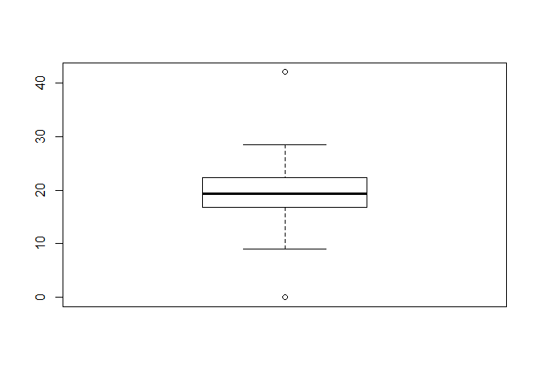

Math/Stats 3340 Group 38 Final Project Code
================
Samson Mifflin, Dawei Yuan, Mackenzie Frolic-Smart
12/9/2020

``` r
library("caret")
```

    ## Warning: package 'caret' was built under R version 3.6.3

    ## Loading required package: lattice

    ## Loading required package: ggplot2

    ## Warning: package 'ggplot2' was built under R version 3.6.3

``` r
library("MPV")
```

    ## Warning: package 'MPV' was built under R version 3.6.3

    ## Loading required package: KernSmooth

    ## KernSmooth 2.23 loaded
    ## Copyright M. P. Wand 1997-2009

``` r
library("faraway")
```

    ## Warning: package 'faraway' was built under R version 3.6.3

    ## 
    ## Attaching package: 'faraway'

    ## The following object is masked from 'package:lattice':
    ## 
    ##     melanoma

``` r
library("mltools")
```

    ## Warning: package 'mltools' was built under R version 3.6.3

``` r
library(data.table)
```

    ## Warning: package 'data.table' was built under R version 3.6.3

``` r
library(MASS)
```

    ## 
    ## Attaching package: 'MASS'

    ## The following object is masked from 'package:MPV':
    ## 
    ##     cement

``` r
# synthetic data point already added as the last row of the csv, row8129
cardata<-read.csv("C:\\Users\\sjmif\\Downloads\\cardetailsv3withsynth.csv")
attach(cardata)
summary(cardata)
```

    ##                          name           year      selling_price     
    ##  Maruti Swift Dzire VDI    : 129   Min.   :1983   Min.   :    9495  
    ##  Maruti Alto 800 LXI       :  82   1st Qu.:2011   1st Qu.:  254999  
    ##  Maruti Alto LXi           :  71   Median :2015   Median :  450000  
    ##  BMW X4 M Sport X xDrive20d:  62   Mean   :2014   Mean   :  638194  
    ##  Maruti Swift VDI          :  61   3rd Qu.:2017   3rd Qu.:  675000  
    ##  Maruti Swift VDI BSIV     :  59   Max.   :2020   Max.   :10000000  
    ##  (Other)                   :7665                                    
    ##    km_driven           fuel                seller_type      transmission 
    ##  Min.   :      1   CNG   :  57   Dealer          :1127   Automatic:1051  
    ##  1st Qu.:  35000   Diesel:4402   Individual      :6766   Manual   :7078  
    ##  Median :  60000   LPG   :  38   Trustmark Dealer: 236                   
    ##  Mean   :  69872   Petrol:3632                                           
    ##  3rd Qu.:  98000                                                         
    ##  Max.   :2360457                                                         
    ##                                                                          
    ##                   owner           mileage         engine    
    ##  First Owner         :5290   18.9 kmpl: 225   1248 CC:1017  
    ##  Fourth & Above Owner: 174            : 221   1197 CC: 832  
    ##  Second Owner        :2105   19.7 kmpl: 173   998 CC : 453  
    ##  Test Drive Car      :   5   18.6 kmpl: 164   796 CC : 444  
    ##  Third Owner         : 555   21.1 kmpl: 157   2179 CC: 389  
    ##                              17.0 kmpl: 133   1498 CC: 375  
    ##                              (Other)  :7056   (Other):4619  
    ##      max_power               torque         seats       
    ##  74 bhp   : 377   190Nm@ 2000rpm: 530   Min.   : 2.000  
    ##  81.80 bhp: 220   200Nm@ 1750rpm: 445   1st Qu.: 5.000  
    ##           : 215   90Nm@ 3500rpm : 405   Median : 5.000  
    ##  88.5 bhp : 204   113Nm@ 4200rpm: 223   Mean   : 5.417  
    ##  67 bhp   : 165                 : 222   3rd Qu.: 5.000  
    ##  46.3 bhp : 162   114Nm@ 4000rpm: 171   Max.   :14.000  
    ##  (Other)  :6786   (Other)       :6133   NA's   :221

``` r
#remove NA's
cardata<-cardata[complete.cases(cardata),]
anyNA(cardata)
```

    ## [1] FALSE

``` r
#first column should now just be year.
cardata<-data.frame(cardata[,-1])
cardata[(1:5),1]
```

    ## [1] 2014 2014 2006 2010 2007

``` r
#switch to car age
cardata$car_age<-with(cardata,2020-cardata$year)
#prune year column
cardata<-data.frame(cardata[,-1])
```

``` r
#cleaning columns with symbols
cardata$max_power<-{as.numeric(gsub("[a-zA-Z/]", "",cardata$max_power))}
cardata$engine<-{as.numeric(gsub("[a-zA-Z/]", "",cardata$engine))}
cardata$mileage<-{as.numeric(gsub("[a-zA-Z]", "",cardata$mileage))}
```

    ## Warning: NAs introduced by coercion

``` r
#the rows with CNG and LPG fuel are also removed by the previous line
```

``` r
cardata<-cardata[complete.cases(cardata),]
anyNA(cardata)
```

    ## [1] FALSE

``` r
#taking out torque column
cardata<-data.frame(cardata[,-10])
```

``` r
#visualizing the data
#table(cardata$car_age)
boxplot(cardata$car_age)
```

<!-- -->

``` r
barplot(table(cardata$car_age),
main="Bar Chart of Years",
xlab="Year",
ylab="Count",
border="red",
col="blue",
density=10
)
```

<!-- -->

``` r
boxplot(cardata$selling_price,main="Selling Price boxplot")
```

<!-- -->

``` r
hist (cardata$selling_price, breaks=30, col="violet", xlab="Selling Price", main="Selling Price histogram")
```

<!-- -->

``` r
boxplot(log(cardata$selling_price))       
```

<!-- -->

``` r
#boxplot(scale(cardata$selling_price, center= TRUE, scale=TRUE),main="scaled Selling Price boxplot")       
#boxplot(scale(log(cardata$selling_price), center= TRUE, scale=TRUE),main="scaled Selling Price boxplot")              
        
boxplot(cardata$km_driven)
```

<!-- -->

``` r
hist (cardata$km_driven, breaks=30, col="violet", xlab="Selling Price", main="km driven histogram")
```

<!-- -->

``` r
boxplot(log(cardata$km_driven)) 
```

<!-- -->

``` r
table(cardata$fuel)
```

    ## 
    ##    CNG Diesel    LPG Petrol 
    ##      0   4299      0   3521

``` r
barplot(table(cardata$fuel),
main="Bar Chart of Fuel",
xlab="Fuel",
ylab="Count",
border="red",
col="blue",
density=10
)
```

<!-- -->

``` r
barplot(table(cardata$seller_type),
main="Bar Chart of Seller Type",
xlab="Fuel",
ylab="Count",
border="red",
col="blue",
density=10
)
```

<!-- -->

``` r
barplot(table(cardata$transmission),
main="Bar Chart of Transmission",
xlab="Fuel",
ylab="Count",
border="red",
col="blue",
density=10
)
```

<!-- -->

``` r
barplot(table(cardata$owner),
main="Bar Chart of Owner",
xlab="Fuel",
ylab="Count",
border="red",
col="blue",
density=10
)
```

<!-- -->

``` r
boxplot(cardata$mileage)
```

<!-- -->

``` r
hist (cardata$mileage, breaks=15, col="violet", xlab="Selling Price", main="Selling Price histogram")
```

<!-- -->

``` r
barplot(table(cardata$seats),
main="Bar Chart of Seats",
xlab="Fuel",
ylab="Count",
border="red",
col="blue",
density=10
)
```

<!-- -->

``` r
barplot(table(cardata$max_power),
main="Bar Chart of Max Power",
xlab="Fuel",
ylab="Count",
border="red",
col="blue",
density=10
)
```

<!-- -->

``` r
boxplot(cardata$max_power, center= TRUE, scale=TRUE,main="max power boxplot")
```

<!-- -->

``` r
# make correlation matrix
cormat <- round(cor(cardata[c(1,2,7,8,9,10,11)]),4)
head(cormat)
```

    ##               selling_price km_driven mileage  engine max_power   seats
    ## selling_price        1.0000   -0.2223 -0.1254  0.4538    0.7494  0.0394
    ## km_driven           -0.2223    1.0000 -0.1745  0.2089   -0.0358  0.2276
    ## mileage             -0.1254   -0.1745  1.0000 -0.5789   -0.3736 -0.4539
    ## engine               0.4538    0.2089 -0.5789  1.0000    0.7016  0.6101
    ## max_power            0.7494   -0.0358 -0.3736  0.7016    1.0000  0.1883
    ## seats                0.0394    0.2276 -0.4539  0.6101    0.1883  1.0000
    ##               car_age
    ## selling_price -0.4128
    ## km_driven      0.4251
    ## mileage       -0.3275
    ## engine        -0.0174
    ## max_power     -0.2280
    ## seats          0.0082

``` r
#library(reshape2)
#melted_cormat <- melt(cormat)
#library(ggplot2)
#ggplot(data=melted_cormat, aes(x=Var1,y=Var2,fill=value)) + geom+tile()
```

``` r
#remove rows where mileage is 0
cardata<-cardata[!(cardata$mileage<0.001),]
```

``` r
#checking the data before getting logs
summary(cardata)
```

    ##  selling_price        km_driven           fuel     
    ##  Min.   :    9495   Min.   :   1000   CNG   :   0  
    ##  1st Qu.:  270000   1st Qu.:  34000   Diesel:4293  
    ##  Median :  455000   Median :  60000   LPG   :   0  
    ##  Mean   :  653772   Mean   :  69191   Petrol:3510  
    ##  3rd Qu.:  695000   3rd Qu.:  96000                
    ##  Max.   :10000000   Max.   :2360457                
    ##            seller_type      transmission                   owner     
    ##  Dealer          :1103   Automatic:1036   First Owner         :5156  
    ##  Individual      :6464   Manual   :6767   Fourth & Above Owner: 157  
    ##  Trustmark Dealer: 236                    Second Owner        :1984  
    ##                                           Test Drive Car      :   5  
    ##                                           Third Owner         : 501  
    ##                                                                      
    ##     mileage          engine       max_power          seats       
    ##  Min.   : 9.00   Min.   : 624   Min.   : 34.20   Min.   : 4.000  
    ##  1st Qu.:16.78   1st Qu.:1197   1st Qu.: 69.00   1st Qu.: 5.000  
    ##  Median :19.30   Median :1248   Median : 82.50   Median : 5.000  
    ##  Mean   :19.43   Mean   :1463   Mean   : 91.94   Mean   : 5.423  
    ##  3rd Qu.:22.32   3rd Qu.:1582   3rd Qu.:102.00   3rd Qu.: 5.000  
    ##  Max.   :42.00   Max.   :3604   Max.   :400.00   Max.   :14.000  
    ##     car_age      
    ##  Min.   : 0.000  
    ##  1st Qu.: 3.000  
    ##  Median : 5.000  
    ##  Mean   : 6.005  
    ##  3rd Qu.: 8.000  
    ##  Max.   :26.000

``` r
cardata$selling_price <- log(cardata$selling_price)
cardata$km_driven <- log(cardata$km_driven)
cardata$max_power <- log(cardata$max_power)
#checking the data after getting logs
summary(cardata)
```

    ##  selling_price      km_driven          fuel                seller_type  
    ##  Min.   : 9.159   Min.   : 6.908   CNG   :   0   Dealer          :1103  
    ##  1st Qu.:12.506   1st Qu.:10.434   Diesel:4293   Individual      :6464  
    ##  Median :13.028   Median :11.002   LPG   :   0   Trustmark Dealer: 236  
    ##  Mean   :13.005   Mean   :10.847   Petrol:3510                          
    ##  3rd Qu.:13.452   3rd Qu.:11.472                                        
    ##  Max.   :16.118   Max.   :14.674                                        
    ##     transmission                   owner         mileage     
    ##  Automatic:1036   First Owner         :5156   Min.   : 9.00  
    ##  Manual   :6767   Fourth & Above Owner: 157   1st Qu.:16.78  
    ##                   Second Owner        :1984   Median :19.30  
    ##                   Test Drive Car      :   5   Mean   :19.43  
    ##                   Third Owner         : 501   3rd Qu.:22.32  
    ##                                               Max.   :42.00  
    ##      engine       max_power         seats           car_age      
    ##  Min.   : 624   Min.   :3.532   Min.   : 4.000   Min.   : 0.000  
    ##  1st Qu.:1197   1st Qu.:4.234   1st Qu.: 5.000   1st Qu.: 3.000  
    ##  Median :1248   Median :4.413   Median : 5.000   Median : 5.000  
    ##  Mean   :1463   Mean   :4.457   Mean   : 5.423   Mean   : 6.005  
    ##  3rd Qu.:1582   3rd Qu.:4.625   3rd Qu.: 5.000   3rd Qu.: 8.000  
    ##  Max.   :3604   Max.   :5.991   Max.   :14.000   Max.   :26.000

``` r
# scale carData
scaledData <- cardata
scaledData[c(1,2,7,8,9,10,11)] <- lapply(scaledData[c(1,2,7,8,9,10,11)], function(x) c(scale(x)))
#checking the data after unit normal scaling
summary(scaledData)
```

    ##  selling_price        km_driven           fuel     
    ##  Min.   :-4.64056   Min.   :-4.5098   CNG   :   0  
    ##  1st Qu.:-0.60220   1st Qu.:-0.4726   Diesel:4293  
    ##  Median : 0.02735   Median : 0.1777   LPG   :   0  
    ##  Mean   : 0.00000   Mean   : 0.0000   Petrol:3510  
    ##  3rd Qu.: 0.53836   3rd Qu.: 0.7158                
    ##  Max.   : 3.75493   Max.   : 4.3819                
    ##            seller_type      transmission                   owner     
    ##  Dealer          :1103   Automatic:1036   First Owner         :5156  
    ##  Individual      :6464   Manual   :6767   Fourth & Above Owner: 157  
    ##  Trustmark Dealer: 236                    Second Owner        :1984  
    ##                                           Test Drive Car      :   5  
    ##                                           Third Owner         : 501  
    ##                                                                      
    ##     mileage             engine          max_power           seats        
    ##  Min.   :-2.67265   Min.   :-1.6641   Min.   :-2.6462   Min.   :-1.4789  
    ##  1st Qu.:-0.67936   1st Qu.:-0.5274   1st Qu.:-0.6381   1st Qu.:-0.4396  
    ##  Median :-0.03372   Median :-0.4262   Median :-0.1269   Median :-0.4396  
    ##  Mean   : 0.00000   Mean   : 0.0000   Mean   : 0.0000   Mean   : 0.0000  
    ##  3rd Qu.: 0.74003   3rd Qu.: 0.2364   3rd Qu.: 0.4801   3rd Qu.:-0.4396  
    ##  Max.   : 5.78218   Max.   : 4.2478   Max.   : 4.3896   Max.   : 8.9146  
    ##     car_age       
    ##  Min.   :-1.5535  
    ##  1st Qu.:-0.7774  
    ##  Median :-0.2600  
    ##  Mean   : 0.0000  
    ##  3rd Qu.: 0.5161  
    ##  Max.   : 5.1728

``` r
boxplot(scaledData$max_power, center= TRUE, scale=TRUE,main="log(max power) boxplot")
```

<!-- -->

``` r
boxplot(scaledData$selling_price, center= TRUE, scale=TRUE,main="log(selling price) boxplot")
```

<!-- -->

``` r
boxplot(scaledData$km_driven, center= TRUE, scale=TRUE,main="log(km driven) boxplot")
```

<!-- -->

``` r
#test train split
set.seed(13)
n=ceiling(0.8*length(scaledData$selling_price))
train.sample=sample(c(1:length(scaledData$selling_price)),n)
train.sample=sort(train.sample)
train_data<- scaledData[train.sample, ]
test_data <- scaledData[-train.sample, ]
```

``` r
#MODEL SELECTION
#define model with all predictors
fullModelscaledData<-lm(selling_price ~ .,data = train_data)
```

``` r
#stepwise bidirectional variable selection
print('VARIABLE SELECTION STEPWISE')
```

    ## [1] "VARIABLE SELECTION STEPWISE"

``` r
step.model.scaledData<-stepAIC(fullModelscaledData,direction = "both", trace = F)
summary(step.model.scaledData)
```

    ## 
    ## Call:
    ## lm(formula = selling_price ~ km_driven + fuel + seller_type + 
    ##     transmission + owner + mileage + engine + max_power + seats + 
    ##     car_age, data = train_data)
    ## 
    ## Residuals:
    ##     Min      1Q  Median      3Q     Max 
    ## -6.1221 -0.2252  0.0324  0.2376  2.0135 
    ## 
    ## Coefficients:
    ##                              Estimate Std. Error t value Pr(>|t|)    
    ## (Intercept)                  0.501265   0.020241  24.765  < 2e-16 ***
    ## km_driven                   -0.077669   0.006492 -11.964  < 2e-16 ***
    ## fuelPetrol                  -0.163294   0.014350 -11.379  < 2e-16 ***
    ## seller_typeIndividual       -0.137375   0.015252  -9.007  < 2e-16 ***
    ## seller_typeTrustmark Dealer -0.090267   0.031007  -2.911  0.00361 ** 
    ## transmissionManual          -0.323164   0.017679 -18.279  < 2e-16 ***
    ## ownerFourth & Above Owner   -0.145141   0.035645  -4.072 4.72e-05 ***
    ## ownerSecond Owner           -0.077729   0.012236  -6.352 2.27e-10 ***
    ## ownerTest Drive Car          0.784113   0.167597   4.679 2.95e-06 ***
    ## ownerThird Owner            -0.140397   0.021330  -6.582 5.01e-11 ***
    ## mileage                      0.079659   0.008362   9.527  < 2e-16 ***
    ## engine                       0.196488   0.010799  18.195  < 2e-16 ***
    ## max_power                    0.395094   0.008060  49.020  < 2e-16 ***
    ## seats                        0.028440   0.007132   3.987 6.75e-05 ***
    ## car_age                     -0.456304   0.007408 -61.595  < 2e-16 ***
    ## ---
    ## Signif. codes:  0 '***' 0.001 '**' 0.01 '*' 0.05 '.' 0.1 ' ' 1
    ## 
    ## Residual standard error: 0.3731 on 6228 degrees of freedom
    ## Multiple R-squared:  0.8597, Adjusted R-squared:  0.8594 
    ## F-statistic:  2727 on 14 and 6228 DF,  p-value: < 2.2e-16

``` r
select.mod.scaledData<-step(fullModelscaledData)
```

    ## Start:  AIC=-12296.16
    ## selling_price ~ km_driven + fuel + seller_type + transmission + 
    ##     owner + mileage + engine + max_power + seats + car_age
    ## 
    ##                Df Sum of Sq     RSS      AIC
    ## <none>                       866.81 -12296.2
    ## - seats         1      2.21  869.02 -12282.2
    ## - seller_type   2     11.32  878.13 -12219.2
    ## - owner         4     12.79  879.60 -12212.7
    ## - mileage       1     12.63  879.44 -12207.8
    ## - fuel          1     18.02  884.83 -12169.7
    ## - km_driven     1     19.92  886.73 -12156.3
    ## - engine        1     46.08  912.88 -11974.8
    ## - transmission  1     46.51  913.31 -11971.9
    ## - max_power     1    334.44 1201.25 -10261.1
    ## - car_age       1    528.03 1394.84  -9328.3

``` r
print('VIFs')
```

    ## [1] "VIFs"

``` r
vif(select.mod.scaledData)
```

    ##                   km_driven                  fuelPetrol 
    ##                    1.891300                    2.283261 
    ##       seller_typeIndividual seller_typeTrustmark Dealer 
    ##                    1.448754                    1.227063 
    ##          transmissionManual   ownerFourth & Above Owner 
    ##                    1.587964                    1.091976 
    ##           ownerSecond Owner         ownerTest Drive Car 
    ##                    1.280602                    1.008276 
    ##            ownerThird Owner                     mileage 
    ##                    1.198052                    3.127678 
    ##                      engine                   max_power 
    ##                    5.210216                    2.913884 
    ##                       seats                     car_age 
    ##                    2.260051                    2.452684

``` r
print('Condition Number')
```

    ## [1] "Condition Number"

``` r
kappa(select.mod.scaledData)
```

    ## [1] 48.63646

``` r
print('Confidence Interval of Coefficients')
```

    ## [1] "Confidence Interval of Coefficients"

``` r
confint(select.mod.scaledData)
```

    ##                                   2.5 %      97.5 %
    ## (Intercept)                  0.46158611  0.54094383
    ## km_driven                   -0.09039515 -0.06494289
    ## fuelPetrol                  -0.19142520 -0.13516207
    ## seller_typeIndividual       -0.16727455 -0.10747467
    ## seller_typeTrustmark Dealer -0.15105103 -0.02948337
    ## transmissionManual          -0.35782127 -0.28850715
    ## ownerFourth & Above Owner   -0.21501758 -0.07526429
    ## ownerSecond Owner           -0.10171645 -0.05374251
    ## ownerTest Drive Car          0.45556502  1.11266066
    ## ownerThird Owner            -0.18221053 -0.09858405
    ## mileage                      0.06326710  0.09605053
    ## engine                       0.17531826  0.21765841
    ## max_power                    0.37929393  0.41089415
    ## seats                        0.01445810  0.04242179
    ## car_age                     -0.47082659 -0.44178142

``` r
plot(select.mod.scaledData, which=1, col=c("blue")) # Residuals vs Fitted Plot
```

<!-- -->

``` r
plot(select.mod.scaledData, which=2, col=c("red"))  # Q-Q Plot
```

<!-- -->

``` r
plot(select.mod.scaledData, which=3, col=c("blue"))  # Scale-Location Plot
```

<!-- -->

``` r
plot(select.mod.scaledData, which=5, col=c("blue"))  # Residuals vs Leverage
```

<!-- -->

``` r
cooksd <- cooks.distance(select.mod.scaledData)
print('the largest cooks distance is')
```

    ## [1] "the largest cooks distance is"

``` r
max(cooksd)
```

    ## [1] 0.1690215

``` r
print('the average cooks distance is')
```

    ## [1] "the average cooks distance is"

``` r
mean(cooksd)
```

    ## [1] 0.0002327369

``` r
# Plot the Cook's Distance using the traditional 4/n criterion
plot(cooksd, pch="*", cex=2, main="Influential Obs by Cooks distance")  # plot cook's distance
abline(h = 4/nrow(train_data), col="red")  # add cutoff line
text(x=1:length(cooksd)+1, y=cooksd, labels=ifelse(cooksd>4/nrow(train_data), names(cooksd),""), col="red")  # add labels
```

<!-- -->

``` r
influential <- as.numeric(names(cooksd)[(cooksd > 4 * mean(cooksd, na.rm = TRUE))]) 
length(influential)
```

    ## [1] 185

``` r
# backward variable selection
print('BACKWARD SELECTION')
```

    ## [1] "BACKWARD SELECTION"

``` r
step.backward.model.scaledData<-stepAIC(fullModelscaledData,selection = "backward", trace = F)
summary(step.backward.model.scaledData)
```

    ## 
    ## Call:
    ## lm(formula = selling_price ~ km_driven + fuel + seller_type + 
    ##     transmission + owner + mileage + engine + max_power + seats + 
    ##     car_age, data = train_data)
    ## 
    ## Residuals:
    ##     Min      1Q  Median      3Q     Max 
    ## -6.1221 -0.2252  0.0324  0.2376  2.0135 
    ## 
    ## Coefficients:
    ##                              Estimate Std. Error t value Pr(>|t|)    
    ## (Intercept)                  0.501265   0.020241  24.765  < 2e-16 ***
    ## km_driven                   -0.077669   0.006492 -11.964  < 2e-16 ***
    ## fuelPetrol                  -0.163294   0.014350 -11.379  < 2e-16 ***
    ## seller_typeIndividual       -0.137375   0.015252  -9.007  < 2e-16 ***
    ## seller_typeTrustmark Dealer -0.090267   0.031007  -2.911  0.00361 ** 
    ## transmissionManual          -0.323164   0.017679 -18.279  < 2e-16 ***
    ## ownerFourth & Above Owner   -0.145141   0.035645  -4.072 4.72e-05 ***
    ## ownerSecond Owner           -0.077729   0.012236  -6.352 2.27e-10 ***
    ## ownerTest Drive Car          0.784113   0.167597   4.679 2.95e-06 ***
    ## ownerThird Owner            -0.140397   0.021330  -6.582 5.01e-11 ***
    ## mileage                      0.079659   0.008362   9.527  < 2e-16 ***
    ## engine                       0.196488   0.010799  18.195  < 2e-16 ***
    ## max_power                    0.395094   0.008060  49.020  < 2e-16 ***
    ## seats                        0.028440   0.007132   3.987 6.75e-05 ***
    ## car_age                     -0.456304   0.007408 -61.595  < 2e-16 ***
    ## ---
    ## Signif. codes:  0 '***' 0.001 '**' 0.01 '*' 0.05 '.' 0.1 ' ' 1
    ## 
    ## Residual standard error: 0.3731 on 6228 degrees of freedom
    ## Multiple R-squared:  0.8597, Adjusted R-squared:  0.8594 
    ## F-statistic:  2727 on 14 and 6228 DF,  p-value: < 2.2e-16

``` r
#forward variable selection
print('FORWARD SELECTION')
```

    ## [1] "FORWARD SELECTION"

``` r
intercept.only.model.scaledData<-lm(selling_price~1,data = train_data)
stepAIC(intercept.only.model.scaledData,direction = "forward")
```

    ## Start:  AIC=-61.31
    ## selling_price ~ 1

    ## 
    ## Call:
    ## lm(formula = selling_price ~ 1, data = train_data)
    ## 
    ## Coefficients:
    ## (Intercept)  
    ##    -0.00497

``` r
step.forward.model.scaledData<-stepAIC(intercept.only.model.scaledData,selection = "forward")
```

    ## Start:  AIC=-61.31
    ## selling_price ~ 1

``` r
summary(step.forward.model.scaledData)
```

    ## 
    ## Call:
    ## lm(formula = selling_price ~ 1, data = train_data)
    ## 
    ## Residuals:
    ##     Min      1Q  Median      3Q     Max 
    ## -4.6356 -0.5972  0.0217  0.5346  3.7599 
    ## 
    ## Coefficients:
    ##             Estimate Std. Error t value Pr(>|t|)
    ## (Intercept) -0.00497    0.01259  -0.395    0.693
    ## 
    ## Residual standard error: 0.995 on 6242 degrees of freedom

``` r
print('VIFs')
```

    ## [1] "VIFs"

``` r
print(vif(step.forward.model.scaledData))
```

    ## named numeric(0)

``` r
print('conditionNumber')
```

    ## [1] "conditionNumber"

``` r
print(kappa(step.forward.model.scaledData))
```

    ## [1] 1

``` r
# compare the selected model and the model where we remove engine
print('Comparing the selected model and the model with engine removed')
```

    ## [1] "Comparing the selected model and the model with engine removed"

``` r
noEngineModel <- lm(formula = selling_price ~ km_driven + fuel + seller_type + transmission + owner + mileage + max_power + seats + car_age, data = train_data)
summary(noEngineModel)
```

    ## 
    ## Call:
    ## lm(formula = selling_price ~ km_driven + fuel + seller_type + 
    ##     transmission + owner + mileage + max_power + seats + car_age, 
    ##     data = train_data)
    ## 
    ## Residuals:
    ##     Min      1Q  Median      3Q     Max 
    ## -6.1421 -0.2403  0.0275  0.2393  1.8113 
    ## 
    ## Coefficients:
    ##                              Estimate Std. Error t value Pr(>|t|)    
    ## (Intercept)                  0.595494   0.020079  29.658  < 2e-16 ***
    ## km_driven                   -0.068861   0.006643 -10.366  < 2e-16 ***
    ## fuelPetrol                  -0.281021   0.013144 -21.381  < 2e-16 ***
    ## seller_typeIndividual       -0.143453   0.015648  -9.168  < 2e-16 ***
    ## seller_typeTrustmark Dealer -0.036336   0.031672  -1.147   0.2513    
    ## transmissionManual          -0.363618   0.017997 -20.204  < 2e-16 ***
    ## ownerFourth & Above Owner   -0.162841   0.036564  -4.454 8.59e-06 ***
    ## ownerSecond Owner           -0.081105   0.012555  -6.460 1.13e-10 ***
    ## ownerTest Drive Car          0.761109   0.171975   4.426 9.78e-06 ***
    ## ownerThird Owner            -0.153987   0.021874  -7.040 2.13e-12 ***
    ## mileage                      0.012854   0.007709   1.667   0.0955 .  
    ## max_power                    0.470488   0.007094  66.323  < 2e-16 ***
    ## seats                        0.080382   0.006707  11.985  < 2e-16 ***
    ## car_age                     -0.457155   0.007602 -60.138  < 2e-16 ***
    ## ---
    ## Signif. codes:  0 '***' 0.001 '**' 0.01 '*' 0.05 '.' 0.1 ' ' 1
    ## 
    ## Residual standard error: 0.3828 on 6229 degrees of freedom
    ## Multiple R-squared:  0.8523, Adjusted R-squared:  0.852 
    ## F-statistic:  2765 on 13 and 6229 DF,  p-value: < 2.2e-16

``` r
vif(noEngineModel)
```

    ##                   km_driven                  fuelPetrol 
    ##                    1.880783                    1.819071 
    ##       seller_typeIndividual seller_typeTrustmark Dealer 
    ##                    1.448059                    1.215849 
    ##          transmissionManual   ownerFourth & Above Owner 
    ##                    1.562849                    1.091163 
    ##           ownerSecond Owner         ownerTest Drive Car 
    ##                    1.280308                    1.008219 
    ##            ownerThird Owner                     mileage 
    ##                    1.196583                    2.524626 
    ##                   max_power                       seats 
    ##                    2.143699                    1.897975 
    ##                     car_age 
    ##                    2.452586

``` r
kappa(noEngineModel)
```

    ## [1] 48.0261

``` r
#test whther coefficient of quadratic and interaction terms are significant
anova(noEngineModel,select.mod.scaledData) # List the least complex model first
```

    ## Analysis of Variance Table
    ## 
    ## Model 1: selling_price ~ km_driven + fuel + seller_type + transmission + 
    ##     owner + mileage + max_power + seats + car_age
    ## Model 2: selling_price ~ km_driven + fuel + seller_type + transmission + 
    ##     owner + mileage + engine + max_power + seats + car_age
    ##   Res.Df    RSS Df Sum of Sq      F    Pr(>F)    
    ## 1   6229 912.88                                  
    ## 2   6228 866.81  1    46.075 331.05 < 2.2e-16 ***
    ## ---
    ## Signif. codes:  0 '***' 0.001 '**' 0.01 '*' 0.05 '.' 0.1 ' ' 1

``` r
train_data[6243,]
```

    ##      selling_price km_driven   fuel seller_type transmission       owner
    ## 8129     -4.640556  2.605095 Petrol      Dealer    Automatic First Owner
    ##        mileage   engine max_power      seats   car_age
    ## 8129 -2.037258 1.063681  1.525696 -0.4395568 -1.553535

``` r
# remove the outlier
print('Removing the synthetic data point')
```

    ## [1] "Removing the synthetic data point"

``` r
#full model
model.outlier8129removed <- lm(formula = selling_price ~ km_driven + fuel + seller_type + transmission + owner + mileage + engine + max_power + seats + car_age, data = train_data,subset=1:6242)
summary(model.outlier8129removed)
```

    ## 
    ## Call:
    ## lm(formula = selling_price ~ km_driven + fuel + seller_type + 
    ##     transmission + owner + mileage + engine + max_power + seats + 
    ##     car_age, data = train_data, subset = 1:6242)
    ## 
    ## Residuals:
    ##      Min       1Q   Median       3Q      Max 
    ## -2.11612 -0.22578  0.03298  0.23476  2.03263 
    ## 
    ## Coefficients:
    ##                              Estimate Std. Error t value Pr(>|t|)    
    ## (Intercept)                  0.513172   0.019808  25.907  < 2e-16 ***
    ## km_driven                   -0.069315   0.006368 -10.884  < 2e-16 ***
    ## fuelPetrol                  -0.159324   0.014037 -11.350  < 2e-16 ***
    ## seller_typeIndividual       -0.144405   0.014923  -9.677  < 2e-16 ***
    ## seller_typeTrustmark Dealer -0.100311   0.030331  -3.307 0.000948 ***
    ## transmissionManual          -0.330371   0.017296 -19.101  < 2e-16 ***
    ## ownerFourth & Above Owner   -0.143955   0.034861  -4.129 3.69e-05 ***
    ## ownerSecond Owner           -0.078757   0.011967  -6.581 5.05e-11 ***
    ## ownerTest Drive Car          0.773642   0.163913   4.720 2.41e-06 ***
    ## ownerThird Owner            -0.140788   0.020861  -6.749 1.62e-11 ***
    ## mileage                      0.074565   0.008183   9.112  < 2e-16 ***
    ## engine                       0.195960   0.010562  18.554  < 2e-16 ***
    ## max_power                    0.393450   0.007883  49.909  < 2e-16 ***
    ## seats                        0.025527   0.006978   3.658 0.000256 ***
    ## car_age                     -0.463307   0.007257 -63.841  < 2e-16 ***
    ## ---
    ## Signif. codes:  0 '***' 0.001 '**' 0.01 '*' 0.05 '.' 0.1 ' ' 1
    ## 
    ## Residual standard error: 0.3649 on 6227 degrees of freedom
    ## Multiple R-squared:  0.8654, Adjusted R-squared:  0.8651 
    ## F-statistic:  2860 on 14 and 6227 DF,  p-value: < 2.2e-16

``` r
vif(model.outlier8129removed)
```

    ##                   km_driven                  fuelPetrol 
    ##                    1.900758                    2.283451 
    ##       seller_typeIndividual seller_typeTrustmark Dealer 
    ##                    1.448725                    1.227530 
    ##          transmissionManual   ownerFourth & Above Owner 
    ##                    1.587235                    1.091977 
    ##           ownerSecond Owner         ownerTest Drive Car 
    ##                    1.280565                    1.008290 
    ##            ownerThird Owner                     mileage 
    ##                    1.198041                    3.129835 
    ##                      engine                   max_power 
    ##                    5.209304                    2.913224 
    ##                       seats                     car_age 
    ##                    2.261368                    2.459797

``` r
kappa(model.outlier8129removed)
```

    ## [1] 48.59561

``` r
plot(model.outlier8129removed, which=1, col=c("blue")) # Residuals vs Fitted Plot
```

<!-- -->

``` r
plot(model.outlier8129removed, which=2, col=c("red"))  # Q-Q Plot
```

<!-- -->

``` r
plot(model.outlier8129removed, which=3, col=c("blue"))  # Scale-Location Plot
```

<!-- -->

``` r
plot(model.outlier8129removed, which=5, col=c("blue"))  # Residuals vs Leverage
```

<!-- -->

``` r
#stepwise bidirectional variable selection
print('VARIABLE SELECTION STEPWISE')
```

    ## [1] "VARIABLE SELECTION STEPWISE"

``` r
step.model.outlier8129removed<-stepAIC(model.outlier8129removed,direction = "both", trace = F)
summary(step.model.outlier8129removed)
```

    ## 
    ## Call:
    ## lm(formula = selling_price ~ km_driven + fuel + seller_type + 
    ##     transmission + owner + mileage + engine + max_power + seats + 
    ##     car_age, data = train_data, subset = 1:6242)
    ## 
    ## Residuals:
    ##      Min       1Q   Median       3Q      Max 
    ## -2.11612 -0.22578  0.03298  0.23476  2.03263 
    ## 
    ## Coefficients:
    ##                              Estimate Std. Error t value Pr(>|t|)    
    ## (Intercept)                  0.513172   0.019808  25.907  < 2e-16 ***
    ## km_driven                   -0.069315   0.006368 -10.884  < 2e-16 ***
    ## fuelPetrol                  -0.159324   0.014037 -11.350  < 2e-16 ***
    ## seller_typeIndividual       -0.144405   0.014923  -9.677  < 2e-16 ***
    ## seller_typeTrustmark Dealer -0.100311   0.030331  -3.307 0.000948 ***
    ## transmissionManual          -0.330371   0.017296 -19.101  < 2e-16 ***
    ## ownerFourth & Above Owner   -0.143955   0.034861  -4.129 3.69e-05 ***
    ## ownerSecond Owner           -0.078757   0.011967  -6.581 5.05e-11 ***
    ## ownerTest Drive Car          0.773642   0.163913   4.720 2.41e-06 ***
    ## ownerThird Owner            -0.140788   0.020861  -6.749 1.62e-11 ***
    ## mileage                      0.074565   0.008183   9.112  < 2e-16 ***
    ## engine                       0.195960   0.010562  18.554  < 2e-16 ***
    ## max_power                    0.393450   0.007883  49.909  < 2e-16 ***
    ## seats                        0.025527   0.006978   3.658 0.000256 ***
    ## car_age                     -0.463307   0.007257 -63.841  < 2e-16 ***
    ## ---
    ## Signif. codes:  0 '***' 0.001 '**' 0.01 '*' 0.05 '.' 0.1 ' ' 1
    ## 
    ## Residual standard error: 0.3649 on 6227 degrees of freedom
    ## Multiple R-squared:  0.8654, Adjusted R-squared:  0.8651 
    ## F-statistic:  2860 on 14 and 6227 DF,  p-value: < 2.2e-16

``` r
select.mod.outlier8129removed<-step(step.model.outlier8129removed)
```

    ## Start:  AIC=-12571.73
    ## selling_price ~ km_driven + fuel + seller_type + transmission + 
    ##     owner + mileage + engine + max_power + seats + car_age
    ## 
    ##                Df Sum of Sq     RSS      AIC
    ## <none>                       828.98 -12571.7
    ## - seats         1      1.78  830.76 -12560.3
    ## - mileage       1     11.05  840.03 -12491.1
    ## - owner         4     12.81  841.79 -12484.0
    ## - seller_type   2     12.48  841.46 -12482.5
    ## - km_driven     1     15.77  844.75 -12456.1
    ## - fuel          1     17.15  846.13 -12445.9
    ## - engine        1     45.83  874.81 -12237.9
    ## - transmission  1     48.57  877.55 -12218.3
    ## - max_power     1    331.61 1160.59 -10473.4
    ## - car_age       1    542.58 1371.56  -9430.8

``` r
print('VIFs')
```

    ## [1] "VIFs"

``` r
vif(step.model.outlier8129removed)
```

    ##                   km_driven                  fuelPetrol 
    ##                    1.900758                    2.283451 
    ##       seller_typeIndividual seller_typeTrustmark Dealer 
    ##                    1.448725                    1.227530 
    ##          transmissionManual   ownerFourth & Above Owner 
    ##                    1.587235                    1.091977 
    ##           ownerSecond Owner         ownerTest Drive Car 
    ##                    1.280565                    1.008290 
    ##            ownerThird Owner                     mileage 
    ##                    1.198041                    3.129835 
    ##                      engine                   max_power 
    ##                    5.209304                    2.913224 
    ##                       seats                     car_age 
    ##                    2.261368                    2.459797

``` r
print('Condition Number')
```

    ## [1] "Condition Number"

``` r
kappa(step.model.outlier8129removed)
```

    ## [1] 48.59561

``` r
print('Confidence Interval of Coefficients')
```

    ## [1] "Confidence Interval of Coefficients"

``` r
confint(select.mod.scaledData)
```

    ##                                   2.5 %      97.5 %
    ## (Intercept)                  0.46158611  0.54094383
    ## km_driven                   -0.09039515 -0.06494289
    ## fuelPetrol                  -0.19142520 -0.13516207
    ## seller_typeIndividual       -0.16727455 -0.10747467
    ## seller_typeTrustmark Dealer -0.15105103 -0.02948337
    ## transmissionManual          -0.35782127 -0.28850715
    ## ownerFourth & Above Owner   -0.21501758 -0.07526429
    ## ownerSecond Owner           -0.10171645 -0.05374251
    ## ownerTest Drive Car          0.45556502  1.11266066
    ## ownerThird Owner            -0.18221053 -0.09858405
    ## mileage                      0.06326710  0.09605053
    ## engine                       0.17531826  0.21765841
    ## max_power                    0.37929393  0.41089415
    ## seats                        0.01445810  0.04242179
    ## car_age                     -0.47082659 -0.44178142

``` r
noEngineModel.outlier8129removed <- lm(formula = selling_price ~ km_driven + fuel + seller_type + transmission + owner + mileage + max_power + seats + car_age, data = train_data,subset=1:6242)
summary(noEngineModel.outlier8129removed)
```

    ## 
    ## Call:
    ## lm(formula = selling_price ~ km_driven + fuel + seller_type + 
    ##     transmission + owner + mileage + max_power + seats + car_age, 
    ##     data = train_data, subset = 1:6242)
    ## 
    ## Residuals:
    ##      Min       1Q   Median       3Q      Max 
    ## -2.17568 -0.23996  0.02714  0.23829  1.83094 
    ## 
    ## Coefficients:
    ##                              Estimate Std. Error t value Pr(>|t|)    
    ## (Intercept)                  0.607185   0.019670  30.869  < 2e-16 ***
    ## km_driven                   -0.060503   0.006523  -9.275  < 2e-16 ***
    ## fuelPetrol                  -0.276721   0.012870 -21.501  < 2e-16 ***
    ## seller_typeIndividual       -0.150490   0.015325  -9.820  < 2e-16 ***
    ## seller_typeTrustmark Dealer -0.046558   0.031013  -1.501    0.133    
    ## transmissionManual          -0.370739   0.017625 -21.035  < 2e-16 ***
    ## ownerFourth & Above Owner   -0.161604   0.035796  -4.515 6.46e-06 ***
    ## ownerSecond Owner           -0.082126   0.012291  -6.682 2.57e-11 ***
    ## ownerTest Drive Car          0.750666   0.168365   4.459 8.40e-06 ***
    ## ownerThird Owner            -0.154342   0.021415  -7.207 6.38e-13 ***
    ## mileage                      0.007924   0.007553   1.049    0.294    
    ## max_power                    0.468635   0.006946  67.470  < 2e-16 ***
    ## seats                        0.077320   0.006569  11.771  < 2e-16 ***
    ## car_age                     -0.464179   0.007454 -62.270  < 2e-16 ***
    ## ---
    ## Signif. codes:  0 '***' 0.001 '**' 0.01 '*' 0.05 '.' 0.1 ' ' 1
    ## 
    ## Residual standard error: 0.3748 on 6228 degrees of freedom
    ## Multiple R-squared:  0.858,  Adjusted R-squared:  0.8577 
    ## F-statistic:  2894 on 13 and 6228 DF,  p-value: < 2.2e-16

``` r
vif(noEngineModel.outlier8129removed)
```

    ##                   km_driven                  fuelPetrol 
    ##                    1.890187                    1.819460 
    ##       seller_typeIndividual seller_typeTrustmark Dealer 
    ##                    1.448025                    1.216331 
    ##          transmissionManual   ownerFourth & Above Owner 
    ##                    1.562117                    1.091164 
    ##           ownerSecond Owner         ownerTest Drive Car 
    ##                    1.280270                    1.008233 
    ##            ownerThird Owner                     mileage 
    ##                    1.196571                    2.526894 
    ##                   max_power                       seats 
    ##                    2.143448                    1.899439 
    ##                     car_age 
    ##                    2.459694

``` r
kappa(noEngineModel.outlier8129removed)
```

    ## [1] 47.98301

``` r
#test whether the adding the engine predictor is significant when compared to the no engine model
anova(noEngineModel.outlier8129removed,step.model.outlier8129removed) # List the least complex model first
```

    ## Analysis of Variance Table
    ## 
    ## Model 1: selling_price ~ km_driven + fuel + seller_type + transmission + 
    ##     owner + mileage + max_power + seats + car_age
    ## Model 2: selling_price ~ km_driven + fuel + seller_type + transmission + 
    ##     owner + mileage + engine + max_power + seats + car_age
    ##   Res.Df    RSS Df Sum of Sq      F    Pr(>F)    
    ## 1   6228 874.81                                  
    ## 2   6227 828.98  1    45.827 344.24 < 2.2e-16 ***
    ## ---
    ## Signif. codes:  0 '***' 0.001 '**' 0.01 '*' 0.05 '.' 0.1 ' ' 1

``` r
Noenginepreds<-predict(noEngineModel.outlier8129removed,test_data)
fullmodelpreds<-predict(model.outlier8129removed,test_data)
selectmodelpreds<-predict(select.mod.outlier8129removed,test_data)
```

``` r
plot(test_data$selling_price,Noenginepreds,abline(c(0,1)), xlab = "actual", ylab = "predicted")
```

<!-- -->

``` r
plot(test_data$selling_price,fullmodelpreds,abline(c(0,1)), xlab = "actual", ylab = "predicted")
```

<!-- -->

``` r
plot(test_data$selling_price,selectmodelpreds,abline(c(0,1)), xlab = "actual", ylab = "predicted")
```

<!-- -->

``` r
RMSE1<-sqrt(sum((Noenginepreds-test_data$selling_price)^2)/length(Noenginepreds))
print(RMSE1)
```

    ## [1] 0.3770149

``` r
RMSE2<-sqrt(sum((fullmodelpreds-test_data$selling_price)^2)/length(fullmodelpreds))
print(RMSE2)
```

    ## [1] 0.3663351

``` r
RMSE3<-sqrt(sum((selectmodelpreds-test_data$selling_price)^2)/length(selectmodelpreds))
print(RMSE3)
```

    ## [1] 0.3663351
